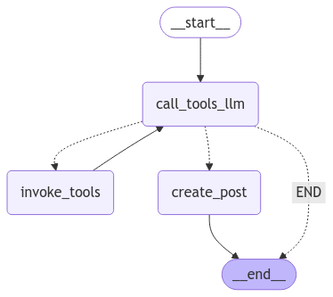

# LinkedIn Content Generation & Automation System

A LangGraph and copilotAgent (Copilotkit) based agent generating and automating LinkedIn posts from multiple content sources, including YouTube, Reddit, Towards Data Science, and LinkedIn profiles.

## Features

- Multi-source content generation:
  - Transcribes YouTube videos
  - Summarizes Reddit posts
  - Processes Towards Data Science articles
  - Analyzes LinkedIn profiles
  - Transcribes audio content
- Automates LinkedIn posting with Playwright
- Optimizes content through OpenAI
- Orchestrates workflows using LangGraph
- Agent and Front-end shares the same state, as copilot kit makes this easy.

## Technical Architecture

Built on a modular architecture using:
- **LangGraph** for orchestrating workflows
- **Playwright** for LinkedIn automation
- **Beautiful Soup** for web scraping

## Prerequisites

- Python 3.11+
- Chrome/Chromium browser
- Valid API keys:
  - OpenAI or Anthropic API
  - Reddit API (PRAW)
  - LinkedIn credentials

## Installation

1. **Clone and setup backend:**
   ```bash
   git clone <repository-url>
   cd agent
   python -m venv .venv
   source .venv/bin/activate  # On Windows: .venv\Scripts\activate
   poetry env use <path to your python executable>
   poetry install
   playwright install
   ```

3. **Configure environment variables:**
   ```bash
   cp .env.example .env
   ```
   Required environment variables:
   ```plaintext
   OPENAI_API_KEY=your_key_here
   ANTHROPIC_API_KEY=your_key_here
   PRAW_CLIENT_ID=your_reddit_client_id
   PRAW_CLIENT_SECRET=your_reddit_client_secret
   PRAW_USER_AGENT=your_user_agent
   LINKEDIN_EMAIL=your_email
   LINKEDIN_PASSWORD=your_password
   ```

## Development

1. **Start the backend:**
   ```bash
   # From the agent directory
   python -m uvicorn main:app --reload
   ```

2. **Just run the agent from notebook**

```python
   result = None
   config = {"configurable": {"thread_id": uuid4()}}
   default = AgentState()
   default.messages.append(
      HumanMessage(content="Create 3 posts from linkedin profile shreyshahh")
   )

   while True:
      result = await workflow.ainvoke(input=result if result else default, config=config)
      next = input(result["messages"][-1].content)
      result["messages"].append(HumanMessage(content=next))
```

## Project Structure

```plaintext
├── agent/                  # Backend
│   ├── backend/
│   │   ├── agent.py       # Main workflow orchestration
│   │   ├── automation/    # LinkedIn automation
│   │   ├── prompts/       # Prompt templates
│   │   ├── schema/        # Data models
│   │   └── utils/         # Helper functions


## API Documentation
The backend exposes the following endpoints:
- `POST /api/post` - Post content to LinkedIn
- `GET /api/status` - Check agent status

See the API documentation at `/docs` when running the backend.

### Wprkflow graph: 


